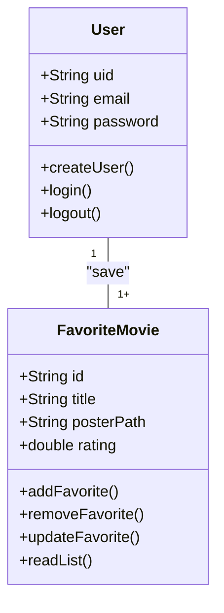
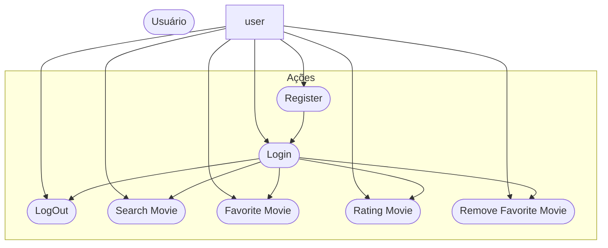
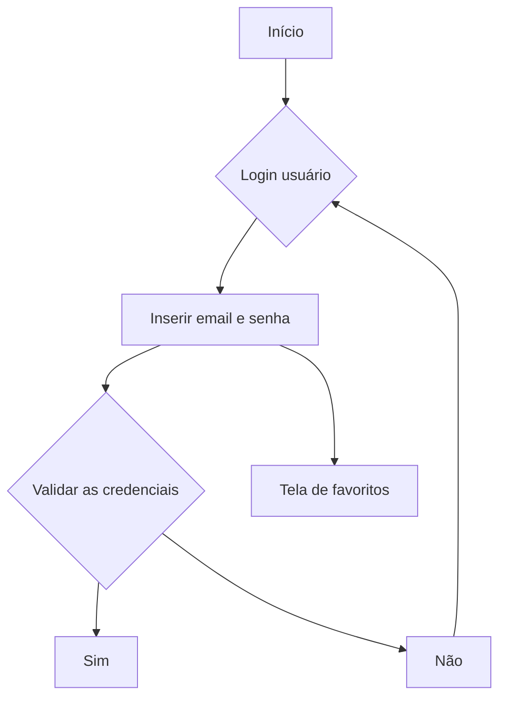

# CineFavorite - Formativa
Construir um aplicativo do zero - O CineFavorite permitirá criar uma conta e buscar filmes em uma API e montar uma galeria pessoal de filmes favoritos, com posters e notas

## Objetivos
- Criar uma galeria personalizada por Usuário de Filmes favoritos
- Conectar o APP com uma API(base de dados) de filmes
- Permitir a criação de contas para cada usuário
- Listar filmes por palavra-chave

## levantamento de requisitos do projeto
- ### Funcionais

- ### Não funcionais

## Recursos do projeto
- Flutter/Dart
- Firebase (Authentication / FireStore DataBase)
- API TMDB
- Figma
- VsCode

## Diagramas

1. ### Classes
    Demonstrar o funcionamento das entidades do sistema
    - Usuário (User) : classe já modela pelo FirebaseAuth
        - email
        - password
        - uid
        - login()
        - create()
        - logout()

    - FilmeFavorito: Classe modelada pelo DEV
        - number:id
        - String: Titulo
        - String: Poster
        - double: Rating
        - adicionar()
        - remover()
        - listar()
        - updateNota()

2. ### Uso
    Ações que os atores podem fazer
    - User:
        - Registrar
        - Login
        - Logout
        - Procurar filmes API
        - Salvar filmes favoritos
        - Dar nota aos filmes
        - Remover dos favoritos

3. ### Fluxo
    Determina o caminho percorrido pelo ator para executar uma ação

    - Ação de login

## Prototipagem

## Codificação